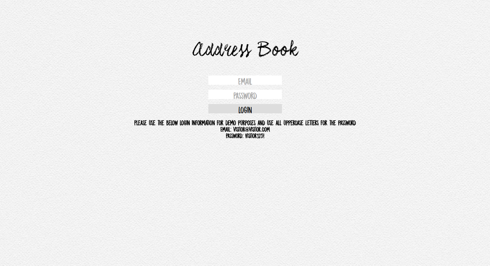
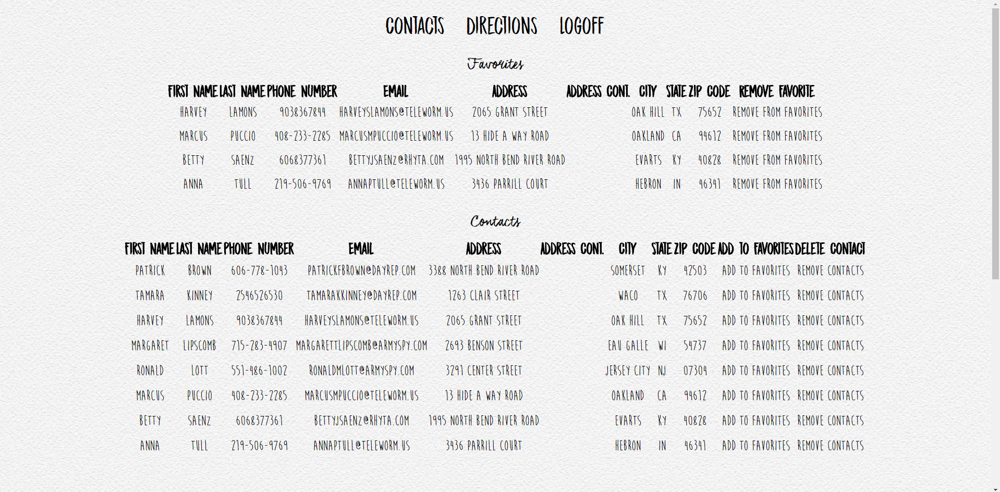
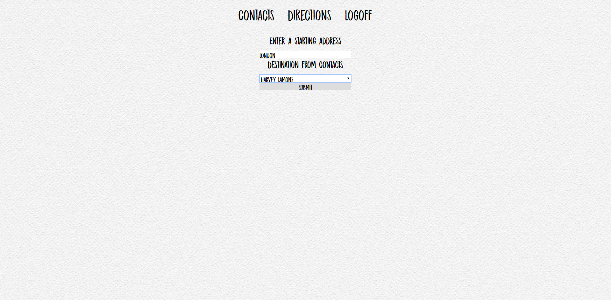

#Address Book 
##Features
* Login with Validations
* Integration of MySQL for database
* Create and delete contacts
* "Favorite" a contact and remove them as needed
* Get directions from start address to a contact in users address book

